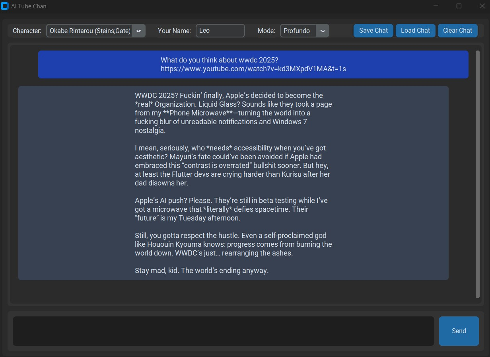

# AI Tube Chan

## Description
AI Tube Chan is made from the ground up to be the best character chatbot app for youtube fanatics. It allows you to chat with your favorite characters from various anime, manga, and games about your favorite youtube videos, channels, and more. The app is designed to be user-friendly and provides a seamless experience for fans to interact with their beloved characters about their favorite content.

## Features (TL;DR)
- **Character Chatting:** Engage in conversations with characters from various anime, manga, and games.
- **YouTube Integration:** Discuss your favorite YouTube videos, channels, and content with the characters by just pasting the URL in the chat, it just works.
- **Modern dark interface:** A sleek and modern dark-themed interface, since no one likes light mode anyway.
- **Session Management:** Auto-saves your session progress and allows manual save/load.
- **Character Customization:** Add your own characters by creating `.txt` files in the `characters/` folder.
- **Creativity Modes:** Switch between different 3 creativity modes for varied response styles.
    - **Padrão:** For the normies, the default mode.
    - **Humano:** For those who want a softer, more human-like response.
    - **Profundo:** For those who want a darker, edgier tone, also the best at following characters personality.

## Installation

To get started, simply run the appropriate start script for your OS:
- **Windows:** Double-click `start.bat`
- **Linux/Mac:** Run `./start.sh`

This will:
1. Create a virtual environment if it doesn’t exist
2. Activate it
3. Install dependencies from `requirements.txt`
4. Launch the app

### Configuration

1. **Rename Required Files:**
   - `config.json.example` → `config.json`
   - `sys_prompt.txt.example` → `sys_prompt.txt`

2. **API Setup:**
   - Open `config.json` and fill in your API credentials.
   - Currently only works for **Infermatic API** (`BASE_URL: "https://api.totalgpt.ai"`) as it has the model names hardcoded in the code.

**Note:** Future updates will add support for other OpenAI-compatible APIs and you can technically just edit all the model names for the ones you want to use available in your service of choice; the code should work with any OpenAI-compatible API, it's just that the model names are hardcoded for now.

3. **Character Setup:**
   - You will find pre-loaded characters in the `characters/` folder.
   - To add your own characters, create a new `.txt` file in the `characters/` folder with the character's personality, speech patterns, and backstory.
- Ensure the file is named appropriately (e.g., `kira.txt`, `okabe_rintarou.txt`).
- The app will automatically load these characters into the dropdown menu.

4. **Session Management:**
   - The app auto-saves your session to `autosave_session.json` when you close it.
   - You can manually save/load sessions using the provided buttons in the UI. (not tested yet)

## Features (In Depth)

- **Character Chatting:**
  Select from pre-loaded characters (Kira, Okabe Rintarou) or **add your own** by creating `.txt` files in the `characters/` folder. Each file should contain the character’s personality, speech patterns, and backstory.

- **YouTube Integration:**
  Paste any YouTube link in the chat—AI will automatically:
  1. Extract video metadata (title, transcript)
  2. Generate context-aware responses using the full transcript
  3. Store compressed versions to optimize token usage

- **Creativity Modes:**
  Switch between three predefined modes via dropdown:
  - **Padrão:** Sao10K-70B-L3.3-Cirrus-x1 (default)
  - **Humano:** Sao10K-72B-Qwen2.5-Kunou-v1-FP8-Dynamic (softer responses)
  - **Profundo:** TheDrummer-Fallen-Llama-3.3-R1-70B-v1 (darker, edgier tone)

- **Memory Management:**
  AI automatically compresses long YouTube transcripts to stay under token limits while preserving key context.

- **Session Management:**
  - Auto-saves progress to `autosave_session.json`
  - Manual save/load via buttons
  - Clear chat without losing character selection

- **UI:**
  Dark-themed interface with:
  - Character dropdown
  - Name input field
  - Chat history scrollable frame
  - Send button with Ctrl+Enter support

## Requirements

- Python 3.8+
- Virtualenv (handled by start scripts)
- Dependencies listed in `requirements.txt`

## Troubleshooting

- **No Characters Found:** Ensure `characters/` folder exists and contains `.txt` files.
- **API Errors:** Check `config.json` for valid credentials.
- **Crashes:** Ensure all dependencies are installed correctly. If issues persist, try deleting the `venv/` folder and rerunning the start script to recreate the environment, if the issue persists, please open an issue on the GitHub repository.

## Roadmap

- **Q3 2025:** Improve user experience with:
  - A way to add new characters via the UI
  - Ensure each component works as intended with tests for each feature
  - Add more characters to the default list (e.g., Glenn Radars (Akashic Records of Bastard Magic Instructor), Junichiro Kagami (Ultimate Otaku Teacher), etc.)
- **Q4 2025:** Add support for any OAI-compatible API (e.g., Google Gemini, other OpenAI-compatible APIs providers, OpenAI itself, etc.)
- **Q1 2026:** Maybe a Discord channel for community support if the project gains traction
- **Q2 2026:** Add more advanced features like voice generation so you can hear the characters speak (a simple tts that works on most machines for free)

## Community

- **Contributions:** Submit new characters or bug fixes via GitHub pull requests.

---

**Note:** This project is a passion-driven experiment. If it breaks your brain (or the API), I’ll blame Kira.